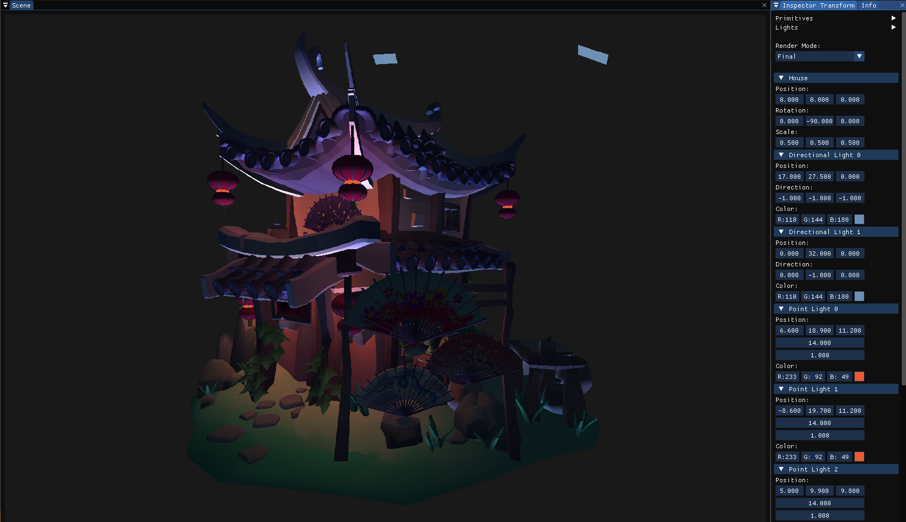

# PGA-Engine

This is a Advanced Graphics Programming Engine in deferred mode for render geometry and lighting.

## Features

- Rendering of meshes and models
- Transformations (Move / Rotate / Scale Entities)
- Uniform blocks and uniform buffers (passing Transforms and lighting)
- Light's types:
    - Directional Light render as quad
    - Point Light as sphere
- Render targets, framebuffers, and render passes

## Render Targets

- Albedo
- Normals
- Position
- Depth
- Final

## Controls

- WASD to move camera
- QE up / down camera
- Mouse righ click to rate camera
- Mouse wheel to zoom
